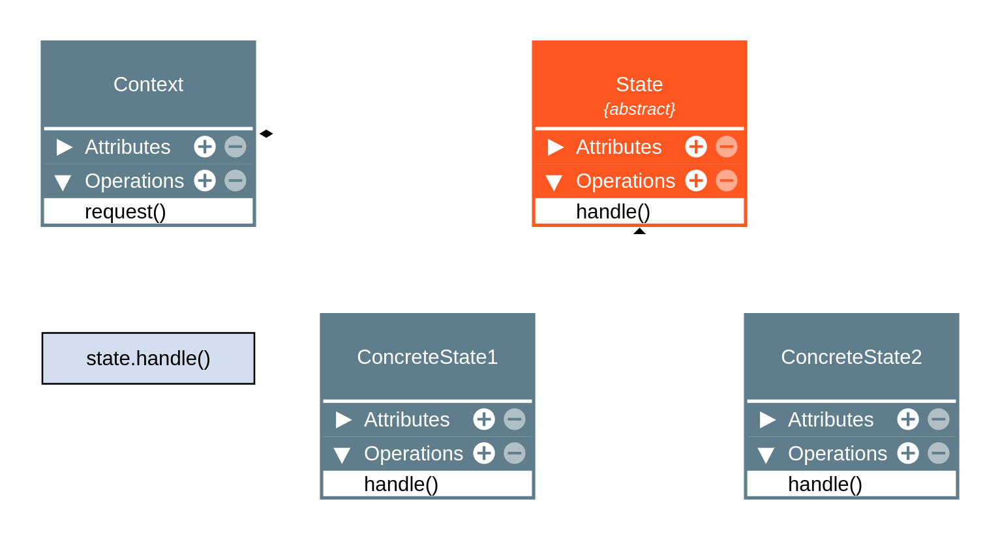

# Design Patterns

São soluções elegantes para problemas `conhecidos e recorrentes` no desenvolvimento de software, que foram utilizadas, testadas no passado e continuam relevantes nos dias atuais. Cada padrão descreve uma forma de resolver um problema comum, facilitando `discussões técnicas` durante o desenvolvimento.

# São divididos em 3 categorias

- `De criação (creational)`, que visam abstrair o processo de como objetos são criados na aplicação.
- `Estruturais (structural)`, que lidam com a criação de classes e objetos.
- `Comportamentais (behavioural)`, que caracterizam como as classes e objetos interagem e distribuem responsabilidade na aplicação.

# Configuração do projeto

## tsconfig.json

É necessário inicializar o repositório executando o comando `npm init -y` e depois instalar o TypeScript com `npm i typescript -D`. Em seguida, é necessário criar o arquivo de configuração do TypeScript chamado `tsconfig.json` e adicionar as seguintes configurações.

- `"target":` o ambiente em que o projeto será executado em produção.
- `"module":` o sistema de módulos.
- `"lib":` as libs que serão utilizadas no projeto.
- `"outDir":` é a saída para onde o código-fonte compilado será enviado.
- `"root":` qual será a raiz do projeto.
- `"removeComments":` remove comentários ao compilar o código.
- `"noEmitOnError":` caso haja algum erro, impossibilita a compilação do código-fonte.
- `"strict":` ativa o modo estrito.
- `"esModuleInterop":` habilita a interoperabilidade entre CommonJS e o ESModules.
- `"skipLibCheck":` pulará a checagem de arquivos de declaração.
- `"forceConsistentCasingInFileNames":` não permite referências inconsistentes em nomes de arquivos.
- `"include":` quais arquivos devem ser incluídos no processo de compilação do TypeScript.

```
{
  "compilerOptions": {
    "target": "ES2019",
    "module": "CommonJS",
    "lib": ["ESNext", "DOM"],
    "outDir": "./dist",
    "rootDir": "./src",
    "removeComments": true,
    "noEmitOnError": true,
    "strict": true,
    "esModuleInterop": true,
    "skipLibCheck": true,
    "forceConsistentCasingInFileNames": true
  },
  "include": [
    "./src"
  ]
}
```

## ts-node

Por conta da configuração `"root"`, ao executar o comando `npx tsc` o código TypeScript é compilado para a pasta `/dist`. No entanto, para compilar o TypeScript o `ts-node` será utilizado em vez disso. Basta instalá-lo executando o comando `npm i -D ts-node` e depois compilar o código com o comando `npx ts-node src/index.ts`.

No entanto, para que não seja necessário digitar o comando, mas sim clicar no botão `Run Code`, basta criar uma pasta chamada `.vscode`, utilizada para configurar o VS Code, e um arquivo chamado `settings.json` dentro dela. Nesse arquivo é possível adicionar configurações locais do projeto no VS Code (parecido com o settings.json global).

```
"code-runner.executorMap": {
  "typescript": "npx ts-node --files --transpile-only",
}
```

## ESLint e Prettier

O ESLint permite criar um padrão no código para que, ao salvar o arquivo .ts, o código seja modificado para estar de acordo com o padrão.

```
console.log("OI")
console.log('OI')
console.log('OI');
```

É necessário instalar a extensão `ESLint`, adicionar o arquivo de configuração `.eslintrc.js`.

```
module.exports = {
  env: {
    browser: true,
    es6: true,
    node: true,
  },
  extends: [
    'eslint:recommended',
    'plugin:@typescript-eslint/eslint-recommended',
    'plugin:@typescript-eslint/recommended',
    'plugin:prettier/recommended',
  ],
  globals: {
    Atomics: 'readonly',
    SharedArrayBuffer: 'readonly',
  },
  parser: '@typescript-eslint/parser',
  parserOptions: {
    ecmaVersion: 11,
    sourceType: 'module',
  },
  plugins: ['@typescript-eslint'],
  rules: {
    '@typescript-eslint/no-empty-function': 'off',
  },
};
```

E instalar algumas dependências executando o seguinte comando `npm i -D @typescript-eslint/eslint-plugin @typescript-eslint/parser prettier eslint-config-prettier eslint-plugin-prettier`.

```
module.exports = {
  semi: true,
  trailingComma: "all",
  singleQuote: false,
  printWidth: 80,
  tabWidth: 2,
  endOfLine: "auto"
}
```

# Singleton

O padrão Singleton garante que uma classe tenha `somente uma instância` no programa e fornece um ponto de acesso global a ela, como ao utilizar variáveis globais. A proteção da instância é feita por meio do encapsulamento do método construtor, evitando que outros códigos sobrescrevam seu valor. O padrão é geralmente usado para `acesso a recursos compartilhados` por toda a aplicação, como acesso à base de dados, interfaces gráficas, sistema de arquivos, servidores de impressão etc. em que é `preferível apenas uma instância` para evitar problemas de concorrência.

Além disso, `módulos` no JavaScript têm `comportamento de Singleton`, pois eles serão sempre os mesmos, ou seja, não haverá a criação de novas instâncias ao importá-los. Um exemplo são os objetos de configuração como o `.eslintrc.js`, que exporta um objeto utilizado em toda a aplicação.

## Estrutura


- `- instance: Singleton` é um atributo privado para a instância.
- `anyData: anyType` é qualquer dado necessário para o Singleton.
- `- <<constructor>> Singleton` é o construtor privado, ou seja, não permite o uso da palavra-chave new com Singleton, e também não aceita parâmetros.
- `+ getInstance(): Singleton` é o getter com instance, onde é decidido se haverá a criação de uma nova instância ou o retorno da instância já criada.
- `anyOperation1()` é qualquer método necessário para o Singleton.

O atributo da instância é definido na classe aceitando inicialmente o `valor null`, e o `método construtor é privado` para impedir a criação de instâncias da classe com a `palavra-chave new`. Ao chamar o `método estático getInstance`, ocorre uma verificação para ter certeza de que a instância existe ou não. Caso ela não exista, a classe é instanciada, a instância é armazenada no atributo instance e é retornada. Se a instância já existir, o valor do atributo `instance` é retornado.

```
class MyDatabaseClassic {
  private static instance: MyDatabaseClassic | null = null;

  private constructor() {}

  public static getInstance(): MyDatabaseClassic {
    if (MyDatabaseClassic.instance === null) {
      MyDatabaseClassic.instance = new MyDatabaseClassic();
    }

    return MyDatabaseClassic.instance;
  }
}

const db1 = MyDatabaseClassic.getInstance();
const db2 = MyDatabaseClassic.getInstance();

console.log(db1 === db2); // true
```

## Aplicabilidade

- Quando uma classe precisa ter somente uma instância disponível em todo seu programa.
- Quando perceber que está usando variáveis globais para manter partes importantes do programa, como variáveis de configuração que são usadas por toda a aplicação.

## Singleton Clássico

```
class MyDatabaseClassic {
  private static _instance: MyDatabaseClassic | null = null;
  private users: User[] = [];

  private constructor() {}

  static get instance(): MyDatabaseClassic {
    if (MyDatabaseClassic._instance === null) {
      MyDatabaseClassic._instance = new MyDatabaseClassic();
    }

    return MyDatabaseClassic._instance;
  }

  add(user: User): void {
    this.users.push(user);
  }

  remove(index: number): void {
    this.users.splice(index, 1);
  }

  show(): void {
    for (const user of this.users) {
      console.log(user);
    }
  }
}
```

## Singleton de Módulo

Um `módulo` é por padrão um singleton, pois não há a criação de novas instâncias ao importá-los.

```
const users: User[] = [];

const MyDatabaseModule = {
  add(user: User): void {
    users.push(user);
  },

  remove(index: number): void {
    users.splice(index, 1);
  },

  show(): void {
    for (const user of users) {
      console.log(user);
    }
  },
};
```

## Singleton de Função

É possível criar um singleton a partir de `closure`. No seguinte caso, uma `IIFE` é criada e ela guarda o `array users` que só pode ser acessado por meio dos métodos que ela retorna.

```
const MyDatabaseFunction = (function () {
  const users: User[] = [];

  return {
    add(user: User): void {
      users.push(user);
    },

    remove(index: number): void {
      users.splice(index, 1);
    },

    show(): void {
      for (const user of users) {
        console.log(user);
      }
    },
  };
})();
```

# Builder

O padrão Builder `separa a construção de um objeto complexo da sua representação`, além da separação do código que cria e o código que usa o objeto, de modo que o `mesmo processo` de construção possa criar `diferentes representações` em casos em que os construtores são muito complexos.

Em vez de construir um objeto diretamente, ele permitir `contruir um objeto em etapas` utilizando `method chaining`, permitindo que o objeto final varie de acordo com a necessidade e seja possível criar objetos complexos e de diversas formas.

## Estrutura


A classe Person é criada, mas a construção do objeto é `desacoplada` da classe em si. Em vez disso, a função de construção do objeto é `delegada` para a `classe Builder`, que contém um atributo privado responsável por armazenar a instância que será construída. Os métodos `retornam a instância criada` para que seja possível criar um objeto customizável a partir de `method chaining`. Além disso, o `método newPerson()` é utilizado para gerar uma `nova instância da classe Person` para que não seja necessário `recriar o objeto da classe PersonBuilder`.

```
class Person {
  constructor(
    public name?: string,
    public age?: number,
  ) {}
}

class PersonBuilder {
  private person = new Person();

  newPerson(): void {
    this.person = new Person();
  }

  setName(name: string): this {
    this.person.name = name;
    return this;
  }

  setAge(age: number): this {
    this.person.age = age;
    return this;
  }

  getResult(): Person {
    return this.person;
  }
}

const personBuilder = new PersonBuilder();
const person1 = personBuilder.setName("Anderson").setAge(20).getResult();
personBuilder.newPerson();
const person2 = personBuilder.setName("Maria").setAge(50).getResult();
```

## Uso do padrão Composite

O padrão composite permite compor objetos em estruturas de árvore para representar hierarquias.

```
interface MealCompositeProtocol {
  getPrice(): number;
}
```

Como várias classes de comida conterão os mesmos métodos, uma classe abstrata foi criada e cada uma das classes de comida herdaram os seus métodos.

```
abstract class AbstractMeal implements MealCompositeProtocol {
  constructor(
    private name: string,
    private price: number,
  ) {}

  getPrice(): number {
    return this.price;
  }
}
```

```
class Rice extends AbstractMeal {}
class Beans extends AbstractMeal {}
class Meat extends AbstractMeal {}
class Beverage extends AbstractMeal {}
class Dessert extends AbstractMeal {}
```

Em seguida, a classe para compor a caixa de comida (a classe composite) é criada.

```
class MealBox implements MealCompositeProtocol {
  private readonly _children: MealCompositeProtocol[] = [];

  getPrice(): number {
    return this._children.reduce((sum, meal) => sum + meal.getPrice(), 0);
  }

  add(...meal: MealCompositeProtocol[]): void {
    meal.forEach((item) => this._children.push(item));
  }
}
```

No entanto, o processo de criação de objetos é extenso, sendo necessário instanciar várias classes.

```
const rice = new Rice("Arroz", 5);
const beans = new Beans("Feijão", 10);
const meat = new Meat("Carne", 20);
const mealBox = new MealBox();
mealBox.add(rice, beans, meat);
console.log(mealBox);
console.log(mealBox.getPrice());
```

## Com Builder

É possível abstrair o código do cliente e diminuir o acoplamento utilizando o padrão Builder.

```
interface MealBuilderProtocol {
  makeMeal(): this;
  makeBeverage(): this;
  makeDessert(): this;
}
```

Os métodos `retornam a instância criada` para que seja possível criar um objeto customizável a partir de `method chaining`. Além disso, o `método reset()` é utilizado para gerar uma `nova instância da classe MealBox` para que não seja necessário `recriar o objeto da classe MainDishBuilder`.

```
class MainDishBuilder implements MealBuilderProtocol {
  private _meal: MealBox = new MealBox();

  reset(): this {
    this._meal = new MealBox();
    return this;
  }

  makeMeal(): this {
    const rice = new Rice("Arroz", 5);
    const beans = new Beans("Feijão", 10);
    const meat = new Meat("Carne", 20);
    this._meal.add(rice, beans, meat);
    return this;
  }

  makeBeverage(): this {
    const beverage = new Beverage("Bebida", 7);
    this._meal.add(beverage);
    return this;
  }

  makeDessert(): this {
    const dessert = new Dessert("Sobremesa", 10);
    this._meal.add(dessert);
    return this;
  }

  getMeal(): MealBox {
    return this._meal;
  }

  getPrice(): number {
    return this._meal.getPrice();
  }
}
```

Dessa forma, para criar o objeto complexo basta fazer `method chaining`.

```
const mainDishBuilder = new MainDishBuilder();
mainDishBuilder.makeMeal();
console.log(mainDishBuilder.getMeal());
console.log(mainDishBuilder.getPrice());

mainDishBuilder.reset();

const meal2 = mainDishBuilder.makeBeverage().getMeal();
console.log(meal2);

const veganDishBuilder = new VeganDishBuilder();
const veganMeal = veganDishBuilder.makeMeal().getMeal();
console.log(veganMeal);
console.log(veganMeal.getPrice());
```

# Prototype

O padrão Prototype especifica os tipos de objetos a serem criados usando uma `instância-protótipo` e criar novos objetos pela cópia desse protótipo, evitando a recriação de objetos "caros" e ajudando a evitar a explosão de subclasses. O tipo de objeto a ser criado é determinado pelo protótipo e geralmente é implementado com um método `clone()` dentro do próprio objeto protótipo, que pode gerar uma cópia superficial ("shallow") ou profunda ("deep") do objeto.

Esse padrão pode ou não manter um registro de objetos protótipos em um objeto separado e evita que o cliente precise conhecer as classes específicas que criam os objetos, simplificando o processo de criação e melhorando a eficiência e a organização do código.

## Sobre JavaScript e TypeScript

- JavaScript/TypeScript são linguagens baseadas em protótipos.
- Objetos estão diretamente ligados a outros objetos.
- Você pode literalmente fazer um objeto "herdar" de outro.
- A "herança" é obtida via delegações (um objeto delega algo para seu protótipo).
- Uma das maneiras mais simples para manipular o protótipo de um objeto é usando Object.create(prototypeObject).
- Também temos o costume de usar classes ou funções construtoras para manipulação de protótipos (isso faz com que JavaScript/TypeScript pareçam estar usando o padrão orientado a objetos clássicos).

No seguinte caso, a variável `anotherPerson` recebe um `objeto vazio com o prototype personPrototype`. Como o objeto está vazio, ao tentar exibir a propriedade firstName do objeto, o JavaScript `delegará` essa propriedade para o `prototype`. No entanto, caso seja adicionada a propriedade `firstName` ao `objeto anotherPerson`, essa propriedade fará `shadowing` na propriedade do prototype.

```
const personPrototype = {
  firstName: "Anderson",
  lastName: "Kaiti",
  age: 20,

  fullName() {
    return `${this.firstName} ${this.lastName}`;
  },
};

const anotherPerson = Object.create(personPrototype);
anotherPerson.firstName = "Joana";

console.log(anotherPerson);
console.log(anotherPerson.firstName);
console.log(anotherPerson.fullName());
```

No seguinte exemplo, foram criadas funções construtoras e o objeto personPrototype, que é o protótipo. Utilizando a propriedade prototype das funções construtoras, é possível fazer elas herdarem as propriedades e métodos do protótipo.

```
function Person(firstName, lastName, age) {
  this.firstName = firstName;
  this.lastName = lastName;
  this.age = age;
}

const personPrototype = {
  firstName: "Anderson",
  lastName: "Kaiti",
  age: 20,

  fullName() {
    return `${this.firstName} ${this.lastName}`;
  },
};

Person.prototype = Object.create(personPrototype);
Person.prototype.constructor = Person;

function SubPerson(firstName, lastName, age) {
  Person.call(this, firstName, lastName, age);
  this.fromSubClass = "OIE";
}

SubPerson.prototype = Object.create(Person.prototype);
SubPerson.prototype.constructor = SubPerson;

const person1 = new Person("João", "Kaiti", 20);
console.log(person1);
console.log(person1.fullName());

const person2 = new SubPerson("Helena", "Vieira", 20);
console.log(person2);
console.log(person2.fullName());
```

## Estrutura


```
interface Prototype {
  clone(): Prototype;
}

class Person implements Prototype {
  public addresses: Address[] = [];

  constructor(
    public name: string,
    public age: number,
  ) {}

  clone(): this {
    const newObject = Object.create(this);
    return newObject;
  }

  addAddress(address: Address): void {
    this.addresses.push(address);
  }
}

class Address {
  constructor(
    public street: string,
    public number: number,
  ) {}
}

const address1 = new Address("Av. Brasil", 15);
const person1 = new Person("Anderson", 20);
person1.addAddress(address1);
const person2 = person1.clone();

person1.addresses[0].street = "Blá, blá, blá";

person2.name = "Person 2";
console.log(person2);
console.log(person2.addresses);
```

## Aplicabilidade

- Quando precisar que seu código não dependa de classes concretas para a criação de novos objetos.
- Quando quiser evitar explosão de subclasses para objetos muito similares.
- Para evitar a recriação de objetos "caros".

# Factory Method

O padrão Factory Method define uma interface para criar um objeto, mas deixa as subclasses decidirem qual classe instanciar, permitindo adiar a instanciação para as subclasses. Fábricas são `operações`, podendo ser métodos ou funções, que criam `objetos`, `ocultando a lógica de instanciação do código cliente` e proporcionando flexibilidade e `desacoplamento`.

Esse padrão de criação lida com a `criação de objetos através de herança`, onde o método fábrica pode ser criado ou `sobrescrito por subclasses`. Ele permite a criação de novas fábricas sem a necessidade de alterar o código existente, seguindo o Princípio Aberto/Fechado (OCP). Além disso, o Factory Method pode usar parâmetros para determinar o tipo dos objetos a serem criados ou os parâmetros a serem passados, oferecendo uma abordagem flexível e extensível para a criação de objetos.

## Estrutura


A `classe Car` é criada implementando a `interface Vehicle` e a `superclasse abstrata VehicleFactory` define o método para criar o veículo, enquanto a subclasse `CarFactory implementa o método` para cria a instância da classe Car.

```
interface Vehicle {
  pickUp(customerName: string): void;
  stop(): void;
}

class Car implements Vehicle {
  constructor(private name: string) {}

  pickUp(customerName: string): void {
    console.log(`${this.name} está buscando o ${customerName}`);
  }

  stop(): void {
    console.log(`${this.name} parou`);
  }
}

abstract class VehicleFactory {
    abstract getVehicle(vehicleName: string): Vehicle;
}

class CarFactory extends VehicleFactory {
  getVehicle(vehicleName: string): Vehicle {
    return new Car(vehicleName);
  }
}

const carFactory = new CarFactory();

const car = carFactory.getVehicle("Citroen");

console.log(car);
```

## Com e sem o Factory Method

Sem o factory method, a `classe concreta Car` está totalmente `acoplada` ao código cliente, ou seja, qualquer mudança nela requer mudanças em todos os lugares onde ela foi utilizada, o que não é bom para aplicações complexas e grandes.

```
const fusca = new Car("Fusca");
fusca.pickUp("Joana");
fusca.stop();
```

Com o factory method, ocorre o desacoplamento da classe concreta ao código cliente, o que é bom para projetos grandes, e torna o código mais flexivel, porque fábrica está livre para extensão, ou seja, é possível criar diferentes tipos de veículos com ela.

```
const carFactory = new CarFactory();

const fusca = carFactory.getVehicle("Fusca");
fusca.pickUp("Joana");
fusca.stop();
```

## Aplicabilidade

- Quando não souber com certeza quais os tipos de objetos o seu código vai precisar.
- Para permitir a extensão de suas factories para criação de novos objetos, seguindo o princípio Aberto/Fechado (OCP).
- Para desacoplar o código que cria do código que usa as classes, seguindo o princípio da  (SRP).
- Para dar um hook (gancho) às subclasses para permitir que elas decidam a lógica de criação de objetos.
- Para eliminar duplicação de código na criação de objetos.

# Abstract Factory

O padrão Abstract Factory fornece uma interface para criação de `famílias de objetos relacionados` ou dependentes sem especificar suas classes concretas. Por ser um padrão de criação, ele lida com a criação de objetos e é composto por `múltiplos factory methods`, agrupando famílias de produtos `compatíveis` em `fábricas concretas`.

Esse padrão separa o código que cria do código que usa os objetos, seguindo o princípio da  (SRP) (SRP). Além disso, permite a fácil implementação de novas famílias de objetos, seguindo o princípio Aberto/Fechado (OCP). A programação fica focada nas interfaces e não em implementação.

## Estrutura


```
interface Customer {
  name: string;
}

class IndividualCustomer implements Customer {
  constructor(public name: string) {
    this.name += " (INDIVIDUAL)";
  }
}

class EnterpriseCustomer implements Customer {
  constructor(public name: string) {
    this.name += " (ENTERPRISE)";
  }
}

interface VehicleProtocol {
  pickUp(): void;
}

class IndividualCar implements VehicleProtocol {
  constructor(
    public name: string,
    private readonly customer: Customer,
  ) {}

  pickUp(): void {
    console.log(
      `${this.name} está buscando ${this.customer.name} (INDIVIDUAL)`,
    );
  }
}

class EnterpriseCar implements VehicleProtocol {
  constructor(
    public name: string,
    private readonly customer: Customer,
  ) {}

  pickUp(): void {
    console.log(
      `${this.name} está buscando ${this.customer.name} (ENTERPRISE)`,
    );
  }
}

interface CreateVehicleCustomerFactory {
  createCustomer(customerName: string): Customer;
  createVehicle(vehicleName: string, customerName: string): VehicleProtocol;
}

class IndividualCreateVehicleCustomerFactory
  implements CreateVehicleCustomerFactory
{
  createCustomer(customerName: string): Customer {
    return new IndividualCustomer(customerName);
  }

  createVehicle(vehicleName: string, customerName: string): VehicleProtocol {
    const customer = this.createCustomer(customerName);
    return new IndividualCar(vehicleName, customer);
  }
}

class EnterpriseCreateVehicleCustomerFactory
  implements CreateVehicleCustomerFactory
{
  createCustomer(customerName: string): Customer {
    return new EnterpriseCustomer(customerName);
  }

  createVehicle(vehicleName: string, customerName: string): VehicleProtocol {
    const customer = this.createCustomer(customerName);
    return new EnterpriseCar(vehicleName, customer);
  }
}
```

## Aplicabilidade

Use o Abstract Factory quando:

- Um sistema deve ser independente de como seus produtos são criados, compostos ou representados.
- Um sistema deve ser configurado com uma família de produtos que podem (ou não) trabalhar juntos.
- Uma família de objetos for projetada para ser usada em conjunto e você necessita garantir essa restrição.
- Você quer fornecer uma biblioteca de classes de protótipos e quer revelar somente suas interfaces, não suas implementação.

# Padrões Estruturais

Os padrões estruturais se preocupam com a forma como os objetos são criados para formar estruturas maiores.

Padrões: Composite, Adapter, Bridge, Decorator, Façade, Flyweight e Proxy.

# Composite

O padrão Composite compõe `objetos em estruturas de árvore` para representar `hierarquias partes-todo`, permitindo que clientes tratem de `maneira uniforme` objetos individuais e composições de objetos. Esse padrão é especialmente útil em estruturas hierárquicas, como árvores, onde um objeto pode conter outros objetos recursivamente.

Ao priorizar a composição sobre a herança, o padrão lida com estruturas complexas de forma uniforme. Um exemplo é tratar tanto um produto individual com preço (uma caixa de leite) quanto uma caixa contendo vários produtos (um fardo de leite) com o mesmo preço da `mesma maneira`, possibilitando a chamada de métodos `tanto na estrutura composta quanto no objeto individual`.

## Estruturas


A classe abstrata ProductComponent é criada, define o método abstrato getPrice e tanto a classe ProductComposite como a classe ProductLeaf herdam ele. Dessa forma, é possível tratar os objetos e a estrutura total de maneira uniforme.

```
// Component
abstract class ProductComponent {
  abstract getPrice(): number;

  add(product: ProductComponent): void {}
  remove(product: ProductComponent): void {}
}

// Leaf
class ProductLeaf extends ProductComponent {
  constructor(
    public name: string,
    public price: number,
  ) {
    super();
  }

  getPrice(): number {
    return this.price;
  }
}

// Composite
class ProductComposite extends ProductComponent {
  private children: ProductComponent[] = [];

  add(...products: ProductComponent[]): void {
    products.forEach((product) => this.children.push(product));
  }

  remove(product: ProductComponent): void {
    const productIndex = this.children.indexOf(product);
    if (productIndex !== -1) this.children.splice(productIndex, 1);
  }

  getPrice(): number {
    return this.children.reduce((sum, child) => sum + child.getPrice(), 0);
  }
}

// Client

const pen = new ProductLeaf("Caneta", 1);
const smatphone = new ProductLeaf("Smartphone", 1_000);
const tShirt = new ProductLeaf("Camiseta", 40);
const productBox = new ProductComposite();
productBox.add(pen, smatphone, tShirt);

const tablet = new ProductLeaf("Tablet", 2_000);
const kindle = new ProductLeaf("Kindle", 300);
const anotherProductBox = new ProductComposite();
anotherProductBox.add(tablet, kindle);

productBox.add(anotherProductBox);

console.log(productBox);
console.log(productBox.getPrice());
```

## Aplicabilidade

Use o padrão Composite quando:

- Sua estrutura de objetos possa ser representada hierarquicamente, como por exemplo estruturas do tipo árvore.
- Você quiser que o código cliente trate objetos composite e objetos simples da mesma maneira.

# Adapter

O padrão Adapter `converte` a interface de uma classe em `outra interface esperada pelos clientes`, permitindo que certas classes com `interfaces incompatíveis trabalhem em conjunto`. Da mesma forma como um adaptador de tomadas converte o formato de plugue para outro, o Adapter `ajusta` uma interface existente para que possa ser utilizada de forma consistente com o restante do sistema.

Ele é um padrão que é frequentemente usado para definir limites dentro de camadas da aplicação e `adaptar interfaces` de código legado para um novo código. Além disso, ele facilita a reutilização de código existente sem modificar o já existente.

## Estrutura


```
import isEmail from "validator/lib/isEmail";

interface EmailValidatorProtocol {
  isEmail: EmailValidatorFnProtocol;
}

interface EmailValidatorFnProtocol {
  (value: string): boolean;
}

class EmailValidatorAdapter implements EmailValidatorProtocol {
  isEmail(value: string): boolean {
    return isEmail(value);
  }
}

const email = "anderkaiti@gmail.com";
const emailValidator = new EmailValidatorAdapter();

if (emailValidator.isEmail(email)) {
  console.log("Email é válido");
} else {
  console.log("Email é inválido");
}
```

## Aplicabilidade

Use o padrão Adapter:

- Você não quiser que seu código dependa diretamente de código de terceiros ou legados.
- Você quiser usar uma classe existente, mas suas interface for incompatível com a interface que seu código ou domínio precisam.
- Você quiser reutilizar várias subclasses que não possuam determinada funcionalidade, mas for impraticável estender o código de cada uma apenas para adicionar a funcionalidade desejada (o Decorator também faz isso).

# Bridge

Bridge é um padrão de projeto estrutural que tem a intenção de `desacoplar` uma `abstração` da sua `implementação`, de modo que as duas possam variar e evoluir independentemente.

- Abstração é um código de alto nível que geralmente delega ações para outro objeto.
- Implementação é o código que realmente faz o trabalho.

## Estrutura


A interface DeviceImplementation define os métodos da classe Tv, responsável por implementar o código.

```
interface DeviceImplementation {
  getName(): string;
  setPower(powerStatus: boolean): void;
  getPower(): boolean;
  setVolume(volume: number): void;
  getVolume(): number;
}
```

```
class Tv implements DeviceImplementation {
  private volume: number = 10;
  private power: boolean = false;
  private name: string = "TV";

  getName(): string {
    return this.name;
  }

  setPower(powerStatus: boolean): void {
    this.power = powerStatus;
  }

  getPower(): boolean {
    return this.power;
  }

  setVolume(volume: number): void {
    if (volume < 0) return;
    if (volume > 100) return;

    this.volume = volume;
  }

  getVolume(): number {
    return this.volume;
  }
}
```

A classe RemoteControl, que é a abstração, contém por composição uma instância da classe Tv.

```
class RemoteControl {
  constructor(protected device: DeviceImplementation) {}

  togglePower(): void {
    this.device.setPower(!this.device.getPower());
    console.log(
      `${this.device.getName()} power status: ${this.device.getPower()}`,
    );
  }
}
```

```
class RemoteControlWithVolume extends RemoteControl {
  volumeUp(): void {
    const oldVolume = this.device.getVolume();
    this.device.setVolume(this.device.getVolume() + 10);
    console.log(
      `${this.device.getName()} tinha o volume ${oldVolume}, agora tem ${this.device.getVolume()}`,
    );
  }

  volumeDown(): void {
    const oldVolume = this.device.getVolume();
    this.device.setVolume(this.device.getVolume() - 10);
    console.log(
      `${this.device.getName()} tinha o volume ${oldVolume}, agora tem ${this.device.getVolume()}`,
    );
  }
}
```

```
const tv = new Tv();
const tvRemoteControl = new RemoteControlWithVolume(tv);

tvRemoteControl.togglePower();
tvRemoteControl.volumeUp();
tvRemoteControl.volumeUp();
tvRemoteControl.volumeDown();
```

## Diferenças entre Bridge e Adapter

(GOF págs. 208) "A diferença-chave entre esses padrões está na suas intenções. O Adapter focaliza
na solução de incompatibilidades entre duas interfaces existentes. [...] Por outro lado, Bridge estabelece uma ponte entre uma abstração e suas (potencialmente numerosas) implementações."

## Aplicabilidade

Use o padrão Bridge quando:

- Você souber que sua estrutura terá abstrações (código de alto nível) e implementações dessa abstração (detalhes) que possam variar de maneira independente.
- Você souber que o Adapter poderia ser aplicado naquela estrutura (você já conhece a estrutura).
- Você quiser dividir uma classe que possa ter diversas variantes (como em produtos e suas variações de cores: CanetaAzul, CanetaVermelha, CamisetaAzul, CamisetaVermelha, etc.).
- Você quer trocar as implementações em tempo de execução.

# Decorator

O padrão Decorator permite `agregar responsabilidades adicionais` a um objeto de maneira dinâmica, fornecendo uma alternativa flexível ao uso de subclasses para extensão de funcionalidades. Em vez de criar subclasses específicas para cada funcionalidade, o padrão usa `composição` para adicionar comportamentos ao `objeto original em tempo de execução`.

Ainda que seja semelhante ao padrão Composite, o Decorator finge ser o objeto decorado, repassando chamadas de métodos para ele, mas também pode executar ações antes e depois das chamadas, além de manipular dados antes do retorno.

## Estrutura


```
interface ProductProtocol {
  getPrice(): number;
  getName(): string;
}
```

```
class TShirt implements ProductProtocol {
  private name: string = "Camiseta";
  private price: number = 49.9;

  getName(): string {
    return this.name;
  }

  getPrice(): number {
    return this.price;
  }
}
```

```
class ProductStampDecorator extends ProductDecorator {
  getName(): string {
    return this.product.getName() + " (Estampada)";
  }

  getPrice(): number {
    return this.product.getPrice() + 10;
  }
}
```

```
const tShirt = new TShirt();
const tShirtWithStamp = new ProductStampDecorator(tShirt);

console.log(tShirt.getPrice(), tShirt.getName());
console.log(tShirtWithStamp.getPrice(), tShirtWithStamp.getName());
```

## Aplicabilidade

Use o padrão Decorator quando:

- Você precisa adicionar funcionalidades em objetos sem quebrar ou alterar o código existente.
- Você quiser usar composição em vez de herança.
- Você percebe que pode ocorrer uma explosão de subclasses em determinada estrutura.

# Façade

Façade (fachada) é um padrão de projeto estrutural que tem a intenção de fornecer uma interface unificada para um conjunto de interfaces em um subsistema. Façade define uma interface de nível alto que torna o subsistema mais flexível de ser usado.

## Estrutura


```
import { MainDishBuilder } from "../../creational/builder/classes/main-dish-builder";
import { VeganDishBuilder } from "../../creational/builder/classes/vegan-dish-builder";

export class BuilderFacade {
  private mainDishBuilder = new MainDishBuilder();
  private veganDishBuilder = new VeganDishBuilder();

  makeMeal1(): void {
    this.mainDishBuilder.makeMeal();
    console.log(this.mainDishBuilder.getMeal());
    console.log(this.mainDishBuilder.getPrice());
  }

  makeMeal2(): void {
    this.mainDishBuilder.reset();
    const meal2 = this.mainDishBuilder.makeBeverage().getMeal();
    console.log(meal2);
  }

  makeMeal3(): void {
    const veganMeal = this.veganDishBuilder.makeMeal().getMeal();
    console.log(veganMeal);
    console.log(veganMeal.getPrice());
  }
}
```

## Aplicabilidade

Use o padrão Façade quando:

- Você quer disponibilizar uma interface mais simples para um sistema complexo.
- Você quer criar pontos de entrada para determinadas partes do sistema, como serviços externos, camadas da aplicação e objetos complexos dentro em determinadas partes do código.

# Proxy

Proxy é um padrão de projeto que tem a intenção de fornecer um substituto ou marcador de localização para outro objeto, controlando o acesso a esse objeto. Ele usa a composição, apresentando uma estrutura semelhante aos padrões "Composite" e "Decorator", apesar de suas intenções serem diferentes. O padrão Proxy usa um objeto "proxy" que finge ser o objeto real, permitindo o controle sobre logs, cache, lazy instantiation e lazy evaluation, distribuição de serviços etc.

O padrão pode escolher como e quando repassar chamadas de métodos para o objeto real e pode executar ações antes e depois das chamadas dos métodos do objeto real. Além disso, existem várias variações do Proxy, incluindo proxy virtual, proxy remoto, proxy de proteção e proxy inteligente.

## Variações do proxy

- Proxy Virtual: controla acesso a recursos que podem ser caros para criação ou utilização.
- Proxy Remoto: controla acesso a recursos que estão em servidores remotos.
- Proxy de proteção: controla o acesso a recursos que possam necessitar autenticação ou permissão.
- Proxy inteligente: além de controlar acesso ao objeto real, também executa tarefas adicionais para saber quando e como executar determinadas ações.

## Estrutura


```
type SystemUserAddressProtocol = {
  street: string;
  number: number;
};

interface SystemUserProtocol {
  firstName: string;
  userName: string;

  getAddresses(): Promise<SystemUserAddressProtocol[]>;
}
```

```
class AdminUser implements SystemUserProtocol {
  public firstName: string;
  public userName: string;

  constructor(firstName: string, userName: string) {
    this.firstName = firstName;
    this.userName = userName;
  }

  async getAddresses(): Promise<SystemUserAddressProtocol[]> {
    return new Promise((resolve) => {
      return setTimeout(() => {
        return resolve([
          {
            street: "Av. Brasil",
            number: 50,
          },
          {
            street: "Rua A",
            number: 40,
          },
        ]);
      }, 2000);
    });
  }
}
```

```
class SystemUserProxy implements SystemUserProtocol {
  private realUser: SystemUserProtocol | null = null;
  private realUserAddresses: SystemUserAddressProtocol[] | null = null;

  constructor(
    public firstName: string,
    public userName: string,
  ) {}

  private createUser(): SystemUserProtocol {
    if (this.realUser === null) {
      this.realUser = new AdminUser(this.firstName, this.userName);
    }

    return this.realUser;
  }

  async getAddresses(): Promise<SystemUserAddressProtocol[]> {
    this.realUser = this.createUser();

    if (this.realUserAddresses === null) {
      this.realUserAddresses = await this.realUser.getAddresses();
    }

    return this.realUserAddresses;
  }
}
```

```
async function clientCode(): Promise<void> {
  const user = new SystemUserProxy("Anderson", "andersonkaiti");
  console.log("Isso vai levar 2 segundos");
  console.log(await user.getAddresses());

  console.log("Isso vai se repetir (CACHE)");
  for (let i = 0; i < 5; i++) {
    console.log(await user.getAddresses());
  }
}

clientCode();
```

## Aplicabilidade

Use o padrão Proxy quando:

- Você tem um objeto caro para ser criado e não quer permitir acesso direto a esse objeto (proxy virtual).
- Você quer restringir acesso a partes da sua aplicação (proxy de proteção).
- Você quer uma ligação entre seu sistema e um sistema remoto (proxy remoto).
- Você quer fazer cache de camadas já realizadas (proxy inteligente ou proxy de cache).
- Você quer interceptar quaisquer chamadas de métodos no objeto real por qualquer motivo (por exemplo, criar logs).

# Flyweight

O Flyweight é um padrão de projeto estrutural que tem a intenção de usar compartilhamento para suportar eficientemente grandes quantidades de objetos de forma granular. É um padrão de otimização que deve ser utilizado com cautela, pois visa aconokmizar memória RAM ao lidar com um grande número de objetos na aplicação.

Esse padrão resolve problemas de desempenho divindo o estado do objeto em "intrínseco" e "extrínseco". O estado intrínseco é aquele que geralmente não muda ou muda muito pouco, enquanto o estado extrínseco pode ser movido para fora do objeto devido a mudanças frequentes. O Flyweight deve ser empregado apensa quando a aplicação estiver enfrentando problemas de alto consumo de memória RAM.

## Estrutura


## Aplicabilidade

Só use o Flyweight se TODAS as condições forem verdadeiras:

- Sua aplicação utiliza uma grande quantidade de objetos.
- Os custos de armazenamento são altos por causa da grande quantidade de objetos.
- A maioria dos estados de objetos podem se tornar extrínsecos.
- Muitos objetos podem ser substituídos por poucos objetos compartilhados.
- A aplicação não depende da identidade dos objetos.

# Padrões Comportamentais

Os padrões de projeto comportamentais se preocupam com algoritmos, a atribuição de responsabilidade entre objetos e os padrões de comunicação entre eles.

Padrões: Chain of responsability, Command, Interpreter, Iterator, Mediator, Memento, Observer, State, Strategy, Template method e Visitor.

# Strategy

O Strategy é um padrão comportamental que consiste em definir uma família de algoritmos, encapsulando cada um deles e tornando-os intercambiáveis. Isso permite que o algoritmo varie independentemente dos clientes que o utilizam, separando a regra de negócio das variações de algoritmos que possam existir.

O padrão usa composição para permitir a troca de algoritmos em tempo de execução, evitando a necessidade de uso de condicionais para a criação de múltiplos algoritmos.

## Estrutura


```
interface ECommerceProductProtocol {
  name: string;
  price: number;
}
```

```
class DiscountStrategy {
  protected discount = 0;

  getDiscount(cart: ECommerceShoppingCart): number {
    return cart.getTotal();
  }
}
```

Por meio de composição, é possível utilizar a classe Strategy dentre da classe ECommerceShoppingCart para obter o desconto do produto.

```
class ECommerceShoppingCart {
  private products: ECommerceProductProtocol[] = [];
  private _discountStrategy: DiscountStrategy = new DiscountStrategy();

  addProduct(...products: ECommerceProductProtocol[]): void {
    products.forEach((product) => this.products.push(product));
  }

  getProducts(): ECommerceProductProtocol[] {
    return this.products;
  }

  getTotal(): number {
    return this.products.reduce((sum, product) => sum + product.price, 0);
  }

  getTotalWithDiscount(): number {
    return this._discountStrategy.getDiscount(this);
  }

  set discount(discount: DiscountStrategy) {
    this._discountStrategy = discount;
  }
}
```

Herdando os atributos e métodos da superclasse DiscountStrategy, é possível criar outras estratégias.

```
class DefaultDiscount extends DiscountStrategy {
  protected discount = 0;

  getDiscount(cart: ECommerceShoppingCart): number {
    const total = cart.getTotal();

    if (total >= 100 && total < 200) {
      this.discount = 10;
    } else if (total >= 200 && total < 300) {
      this.discount = 20;
    } else if (total >= 300) {
      this.discount = 30;
    }

    return total - total * (this.discount / 100);
  }
}
```

E em tempo de execução, é possível alterar a estratégia de desconto a partir do método setter, que sobrescreve a estratégia antiga pela nova estratégia.

```
const shoppingCart = new ECommerceShoppingCart();
shoppingCart.discount = new DefaultDiscount();

shoppingCart.addProduct({ name: "Produto 1", price: 50 });
shoppingCart.addProduct({ name: "Produto 2", price: 50 });
shoppingCart.addProduct({ name: "Produto 1", price: 50 });

console.log(shoppingCart.getTotal());
console.log(shoppingCart.getTotalWithDiscount());
```

## Aplicabilidade

Use o Strategy quando:

- Você tem variantes de um mesmo algoritmo e precisa trocar esses algoritmos em tempo de execução.
- Você precisa isolar a regra de negócio do algoritmo que deve ser aplicado, seguindo o princípio da responsabilidade única (SRP).
- Você perceber que está usando condicionais apenas para trocar o resultado final de um algoritmo.

# Command

O padrão Command encapsula uma solicitação como um objeto, permitindo paramatrizar clientes com diferentes solicitações, enfileirar ou registrar (log) essas solicitações e suportar operações que podem ser desfeitas. Ele transforma uma solicitação em um objeto que contém toda a informação necessária para sua execução. Isso resulta em uma abordagem orientada a objetos para funções de callback, possibilitando que comandos sejam enfileirados, armazenados, desfeitos e registrados para replicação.

Basicamente, o padrão desacopla o código do objeto que faz a solicitação do objeto que a recebe, usando composição em vez de herança.

## Estrutura


```
class SmartHouseLight {
  private isOn: boolean = false;
  private intensity: number = 50;

  constructor(public name: string) {}

  getPowerStatus(): string {
    return this.isOn ? "ON" : "OFF";
  }

  on(): boolean {
    this.isOn = true;
    console.log(`${this.name} agora está ${this.getPowerStatus()}`);
    return this.isOn;
  }

  off(): boolean {
    this.isOn = false;
    console.log(`${this.name} agora está ${this.getPowerStatus()}`);
    return this.isOn;
  }

  increaseIntensity(): number {
    if (this.intensity >= 100) return this.intensity;
    return ++this.intensity;
  }

  decreaseIntensity(): number {
    if (this.intensity <= 0) return this.intensity;
    return --this.intensity;
  }
}
```

```
class LightPowerCommand implements SmartHouseCommand {
  constructor(private readonly light: SmartHouseLight) {}

  execute(): void {
    this.light.on();
  }

  undo(): void {
    this.light.off();
  }
}
```

```
class SmartHouseApp {
  private commands: { [k: string]: SmartHouseCommand } = {};

  addCommand(key: string, command: SmartHouseCommand): void {
    this.commands[key] = command;
  }

  executeCommand(key: string): void {
    this.commands[key].execute();
  }

  undoCommand(key: string): void {
    this.commands[key].undo();
  }
}
```

```
// Receiver
const bedroomLight = new SmartHouseLight("Luz Quarto");
const bathroomLight = new SmartHouseLight("Luz Banheiro");

// Command
const bedroomlightPowerCommand = new LightPowerCommand(bedroomLight);
const bathroomlightPowerCommand = new LightPowerCommand(bathroomLight);

// Controle - Invoker
const smartHouseApp = new SmartHouseApp();
smartHouseApp.addCommand("btn-1", bedroomlightPowerCommand);
smartHouseApp.addCommand("btn-2", bathroomlightPowerCommand);

smartHouseApp.executeCommand("btn-1");
smartHouseApp.undoCommand("btn-1");

smartHouseApp.executeCommand("btn-2");
smartHouseApp.undoCommand("btn-2");
```

## Aplicabilidade

Use o Command quando:

- Você quer desacoplar o objeto que envia a solicitação do objeto que a receberá.
- Você quer tratar um comando como um objeto (com a possibilidade de armazenar, agendas, enfileirar, fazer log, agendar execuções, ou fazer qualquer coisa que pode ser feita com um objeto).
- Você quer permitir que solicitações possam ser feitas e desfeitas.

# Memento

O padrão Memento captura e externaliza um estado interno de um objeto sem violar o encapsulamento, de modo que ele para posteriormente ser restaurado para este estado. Praticamente todas as aplicações o implementam com a função "desfazer" (Ctrl + Z), desacoplando a responsabilidade da classe originadora de tomar conta dos seus backups, garantindo o encapsulamento e consistência nos backups.

## Estrutura


```
interface Memento {
  getName(): string;
  getDate(): Date;
}
```

```
class ConcreteMemento implements Memento {
  constructor(
    private name: string,
    private date: Date,
    private filePath: string,
    private fileFormat: string,
  ) {}

  getName(): string {
    return this.name;
  }

  getDate(): Date {
    return this.date;
  }

  getFilePath(): string {
    return this.filePath;
  }

  getFileFormat(): string {
    return this.fileFormat;
  }
}
```

```
ImageEditor {
  constructor(
    private filePath: string,
    private fileFormat: string,
  ) {}

  convertFormatTo(format: string): void {
    this.fileFormat = format;
    this.filePath = this.filePath.split(".").slice(0, -1).join("");
    this.filePath += "." + format;
  }

  save(): Readonly<Memento> {
    const date = new Date();

    return new ConcreteMemento(
      date.toISOString(),
      date,
      this.filePath,
      this.fileFormat,
    );
  }

  restore(memento: Memento): void {
    const concreteMemento = memento as ConcreteMemento;
    this.filePath = concreteMemento.getFilePath();
    this.fileFormat = concreteMemento.getFileFormat();
  }
}
```

```
class ImageEditorBackupManager {
  private mementos: Memento[] = [];

  constructor(private readonly imageEditor: ImageEditor) {}

  backup(): void {
    console.log(`Backup: salvando o estado de ImageEditor`);
    this.mementos.push(this.imageEditor.save());
  }

  undo(): void {
    const memento = this.mementos.pop();

    if (!memento) {
      console.log("Backup: no memento");
      return;
    }

    this.imageEditor.restore(memento);
    console.log(`Backup: ${memento.getName()} foi restaurado com sucesso`);
  }

  showMementos(): void {
    for (const memento of this.mementos) {
      console.log(memento);
    }
  }
}
```

## ## Aplicabilidade

Use o Memento quando:

- Você quer ter a possibilidade de salvar e restaurar o estado atual de um objeto sem violar o encapsulamento.
- Você deseja implementar a função "desfazer" no seu sistema.
- Você deseja fazer backups de estado de determinadas classes no seu sistema.

# State

O padrão State permite que um objeto altere seu comportamento quando seu estado interno muda, fazendo com que pareça ter mudado a sua classe. Isso evita o uso de condicionais quando um objeto muda de comportamento dependendo do seu estado, desacopla o estado e os métodos de um objeto contexto em objetos de estados separados e facilita a adição de novos estados sem a necessidade de alterar estados anteriores.

## Estrutura



O atributo de estado da classe ShoppingOrder é inicializado com o estado OrderPending. Ao instanciar o estado, o this da classe é passado como argumento para que o estado tenha acesso à classe. Caso o método approvePayment() da classe ShoppintOrder seja chamado, a classe chama o método presente no estado, que, por ter acesso à classe ShoppingOrder, consegue alterar o estado da classe ShoppingOrder para o estado OrderApproved.

```
class ShoppingOrder {
  private state: ShoppingOrderState = new OrderPending(this);

  getState(): ShoppingOrderState {
    return this.state;
  }

  setState(state: ShoppingOrderState): void {
    this.state = state;
    console.log(`O estado do pedido é ${this.getStateName()}`);
  }

  getStateName(): string {
    return this.state.getName();
  }

  approvePayment(): void {
    this.state.approvePayment();
  }

  rejectPayment(): void {
    this.state.rejectPayment();
  }

  waitPayment(): void {
    this.state.waitPayment();
  }

  shipOrder(): void {
    this.state.shipOrder();
  }
}
```

```
export interface ShoppingOrderState {
  getName(): string;
  approvePayment(): void;
  rejectPayment(): void;
  waitPayment(): void;
  shipOrder(): void;
}
```

Cada classe, que representa um estado, contém o seu próprio comportamento e, por conta disso, restringe a classe ShoppingOrder de executar certas operações por conta disso.

```
class OrderPending implements ShoppingOrderState {
  private name: string = "OrderPending";

  constructor(private order: ShoppingOrder) {}

  getName(): string {
    return this.name;
  }

  approvePayment(): void {
    this.order.setState(new OrderApproved(this.order));
  }

  rejectPayment(): void {
    this.order.setState(new OrderRejected(this.order));
  }

  waitPayment(): void {
    console.log("O pedido já está no estado pagamento pendente.");
  }

  shipOrder(): void {
    console.log("Não posso enviar o pedido com pagamento pendente.");
  }
}
```

```
const order = new ShoppingOrder(); // Pendente
order.approvePayment(); // Aprovado
order.waitPayment(); // Pendente
order.shipOrder();
order.rejectPayment(); // Daqui não altera mais o estado
order.approvePayment();
order.waitPayment();
order.approvePayment();
order.shipOrder();
```

## Aplicabilidade

Use o State quando:

- O seu objeto pode se comportar de maneira diferente dependendo do seu estado atual.
- Você quer evitar o uso de condicionais que alteram o comportamento da classe de acordo com os valores dos seus campos.

# Mediator

O padrão Mediator define um objeto que encapsula como um conjunto de objetos interage, promovendo o acoplamento fraco ao evitar que os objetos se refiram explicitamente uns aos outros, permitindo a variação de suas interações. Ele visa encapsular a comunicação direta entre objetos, desacoplar objetos que estariam intimamente ligados e centralizar toda a comunicação em apenas um objeto.

## Estrutura


```
class Mediator {
  private sellers: Seller[] = [];

  addSeller(...sellers: Seller[]): void {
    sellers.forEach((seller) => {
      this.sellers.push(seller);
      seller.setMediator(this);
    });
  }

  buy(id: string): SellerProduct | void {
    let product;

    for (let i = 0; i < this.sellers.length; i++) {
      product = this.sellers[i].sell(id);

      if (product) {
        console.log("Aqui está", product.id, product.name, product.price);
        return;
      }
    }

    console.log("Não encontrei nenhum produto com id", id);
  }

  showProducts(): void {
    this.sellers.forEach((seller) => seller.showProducts());
  }
}
```

```
class Seller {
  private products: SellerProduct[] = [];
  private mediator?: Mediator;

  showProducts(): void {
    this.products.forEach((product) =>
      console.log(product.id, product.name, product.price),
    );
  }

  addProduct(...products: SellerProduct[]): void {
    products.forEach((product) => this.products.push(product));
  }

  setMediator(mediator: Mediator): void {
    this.mediator = mediator;
  }

  sell(id: string): SellerProduct | void {
    const productIndex = this.products.findIndex(
      (product) => product.id === id,
    );

    if (productIndex === -1) return;

    const product = this.products.splice(productIndex, 1);
    return product[0];
  }
}
```

```
const mediator = new Mediator();
const seller1 = new Seller();
seller1.addProduct({ id: "1", name: "Camiseta", price: 49.9 });
seller1.addProduct({ id: "2", name: "Caneta", price: 9.9 });
const seller2 = new Seller();
seller2.addProduct({ id: "3", name: "Carro", price: 49000.9 });
seller2.addProduct({ id: "4", name: "Lápis", price: 1.9 });

mediator.addSeller(seller1, seller2);

mediator.showProducts();
```

## Aplicabilidade

Use o Mediator quando:

- Você quer diminuir ou extinguir o acoplamento direto entre as classes que poderiam estar diretamnete acopladas.
- Você quer simplificar comunicações de muitos-para-muitos para comunicações um-para-muitos.

# Chain of Responsability

O padrão Chain of Responsability evita o acoplamento entre remetente de uma solicitação e o seu destinatário, permitindo que mais de um objeto tenha a chance de tratar a solicitação. Os objetos receptores são encadeados, passando a solicitação ao longo da cadeia até que um objeto a trate. Esse padrão é usado quando uma requisição precisa passar por uma sequência de operações até ser totalmente processada, desacoplando quem envia de quem vai tratar a requisição. É muito usado em requisições HTTP e serve como base para outros padrões de projeto conhecidos, como o Middleware do Express.js.

No Chain of Responsability, um objeto pode tratar a solicitação e passar para o próximo objeto da cadeia, ou simplesmente não tratar e passar para o próximo, além de tratar a requisição e finalizar a cadeia. O cliente tem a flexibilidade de iniciar a requisição de qualquer objeto dentro da cadeia, caso necessário.

## Estrutura


```
class CustomerBudget {
  public approved: boolean = false;

  constructor(public total: number) {}
}
```

```
abstract class BaseBudgetHandler {
  protected nextHandler: BaseBudgetHandler | null = null;

  setNextHandler(handler: BaseBudgetHandler): BaseBudgetHandler {
    this.nextHandler = handler;
    return handler;
  }

  handle(budget: CustomerBudget): CustomerBudget {
    if (this.nextHandler) return this.nextHandler.handle(budget);
    return budget;
  }
}
```

```
class SellerBudgetHandler extends BaseBudgetHandler {
  handle(budget: CustomerBudget): CustomerBudget {
    if (budget.total <= 1000) {
      console.log("O vendedor tratou o orçamento");
      budget.approved = true;
      return budget;
    }

    return super.handle(budget);
  }
}
```

```
class ManagerBudgetHandler extends BaseBudgetHandler {
  handle(budget: CustomerBudget): CustomerBudget {
    if (budget.total <= 5_000) {
      console.log("O gerente tratou o orçamento");
      budget.approved = true;
      return budget;
    }

    return super.handle(budget);
  }
}
```

```
class DirectorBudgetHandler extends BaseBudgetHandler {
  handle(budget: CustomerBudget): CustomerBudget {
    if (budget.total <= 50_000) {
      console.log("O diretor tratou o orçamento");
      budget.approved = true;
      return budget;
    }

    return super.handle(budget);
  }
}
```

```
class CEOBudgetHandler extends BaseBudgetHandler {
  handle(budget: CustomerBudget): CustomerBudget {
    console.log("O CEO trata qualquer orçamento");
    budget.approved = true;
    return budget;
  }
}
```

```
const customerBudget = new CustomerBudget(50_001);

const seller = new SellerBudgetHandler();
seller
  .setNextHandler(new ManagerBudgetHandler())
  .setNextHandler(new DirectorBudgetHandler())
  .setNextHandler(new CEOBudgetHandler());

seller.handle(customerBudget);
console.log(customerBudget);
```

## Aplicabilidade

Use o Chain of Responsability quando:

- Seu sistema precisa processar uma requisição em várias etapas diferentes e você não quer criar uma ordem rígida para o processamento. O Chain of responsability permite que você altere a ordem dos objetos na cadeia facilmente (mesmo assim, mantendo uma ordem específica).
- Você quer aplicar o princípio da responsabilidade única (SRP) para tratamento de dados da requisição. Cada objeto fica responsável por tratar apenas a parte que lhe couber.
- Você quer permitir que os objetos responsáveis pelo tratamento de requisição possam variar em tempo de execução.

# Template Method

O padrão Template Method define o esqueleto de um algoritmo em uma operação, postergando a definição de alguns passos para as subclasses, permitindo que as subclasses redefinam certos passos de um algoritmo sem mudar sua estrutura, mantendo a ordem de chamada de métodos no algoritmo e evitando a duplicação de código dentro da classe base.

Esse padrão substitui condicionais por polimorfismo, permitindo que as subclasses alterem apenas os passos necessários para concluir o algoritmo. Além disso, ele permite a adição de hooks para que as subclasses utilizem em pontos estratégicos do algoritmo.

## Estrutura


```
type CustomerData = {
  name: string;
  age: string;
  cpf: string;
};
```

```
abstract class CustomerDataParser {
  public customerData: CustomerData[] = [];

  constructor(protected filePath: string) {}

  readonly fixCustomerData = async (): Promise<void> => {
    this.customerData = await this.parseData();
    this.hook();
    this.customerData = this.fixCpf();
  };

  private fixCpf(): CustomerData[] {
    return this.customerData.map((customer) => ({
      ...customer,
      cpf: customer.cpf.replace(/\D/g, ""),
    }));
  }

  protected hook(): void {}

  protected abstract async parseData(): Promise<CustomerData[]>;
}
```

```
class CustomerDataParserJson extends CustomerDataParser {
  protected async parseData(): Promise<CustomerData[]> {
    const rawData = await promises.readFile(this.filePath);

    const customerData: CustomerData[] = JSON.parse(rawData.toString());

    return customerData;
  }

  hook(): void {
    console.log("O hook foi executado.");
  }
}
```

```
async function run() {
  const filePathJson = resolve(__dirname, "files", "customer.json");
  const customerDataParserJson = new CustomerDataParserJson(filePathJson);
  await customerDataParserJson.fixCustomerData();
  console.log(customerDataParserJson.customerData);
}

run();
```

## Aplicabilidade

Use o Template Method quando:

- Você precisa de variações de um mesmo algoritmo sem mudar a ordem de execução dos métodos.
- Você percebe que está usando herança para alterar apenas pequenos trechos de código de um algoritmo.

# Observer

O padrão Observer define uma dependência um para muitos entre objetos, de modo que, quando um objeto muda de estado, todos os seus dependentes são automaticamente notificados e atualizados. A implementação envolve dois tipos de objetos: objetos observáveis (Observable) e objetos observadores (Observer). Os objetos observáveis mantêm uma referência para todos os seus observadores, possibilitando adicionar, remover e notificar todos os observadores quando seu estado muda. Objetos observadores (Observer) devem ter meios de receber notificações de seus Observáveis. Geralmente isso é feito com apenas um método.

## Estrutura


```
interface Observable {
  subscribe(...observers: Observer[]): void;
  unsubscribe(observer: Observer): void;
  notify(): void;
}

interface Observer {
  update(...args: unknown[]): void;
}

// Concrete Observable
class InputObservable implements Observable {
  private observers: Observer[] = [];

  constructor(public element: HTMLInputElement) {}

  subscribe(...observers: Observer[]): void {
    observers.forEach((observer) => {
      if (!this.observers.includes(observer)) {
        this.observers.push(observer);
      }
    });
  }

  unsubscribe(observer: Observer): void {
    const observerIndex = this.observers.indexOf(observer);

    if (observerIndex !== -1) {
      this.observers.splice(observerIndex, 1);
    }
  }

  notify(): void {
    this.observers.forEach((observer) => observer.update(this));
  }
}

// Concrete Observer
class ParagraphObserver implements Observer {
  constructor(public element: HTMLParagraphElement) {}

  update(observable: Observable): void {
    if (observable instanceof InputObservable) {
      this.element.innerText = observable.element.value;
    }
  }
}

// Concrete Observer
class DivObserver implements Observer {
  constructor(public element: HTMLDivElement) {}

  update(observable: Observable): void {
    if (observable instanceof InputObservable) {
      this.element.innerText = observable.element.value;
    }
  }
}

// Cliente code
function makeInput(): HTMLInputElement {
  const input = document.createElement("input");
  document.body.appendChild(input);
  return input;
}

function makeParagraph(): HTMLParagraphElement {
  const p = document.createElement("p");
  document.body.appendChild(p);
  p.innerText = "Texto inicial (Hardcoded)";
  return p;
}

function makeDiv(): HTMLDivElement {
  const div = document.createElement("div");
  document.body.appendChild(div);
  div.innerText = "Texto da DIV";
  return div;
}

const input = new InputObservable(makeInput());
const p1 = new ParagraphObserver(makeParagraph());
const p2 = new ParagraphObserver(makeParagraph());
const div1 = new DivObserver(makeDiv());

input.subscribe(p1, p2, div1);

input.element.addEventListener("keyup", function () {
  input.notify();
});

input.unsubscribe(p2);
```

## Aplicabilidade

Use o Observer quando:

- Você precisa notificar vários objetos sobre a mudança de estado de outro(s) objeto(s).

# Iterator

O padrão Iterator fornece uma maneira de acessar sequencialmente os elementos de um objeto agregado sem expor sua representação subjacente. Ele desacopla a intenção principal do objeto do modo como a sua interação e realizada, delegando a iteração para outro objeto.

Isso permite vários tipos de iterators, facilitando a implementação de novos modos de travessia na mesma coleção e encapsulando os detalhes e controlando toda a travessia. O padrão também permite que a coleção troque de iterador em tempo de execução. Além disso, em muitas linguagens de programação, há suporte nativok para trabalhar com iteradores.

## Estrutura


A classe MyDataStructure representa a estrutura de dados que será iterada e, dentro dela, o método [Symbol.iterator] é adicionado permitindo definir o iterador dela.

```
class MyDataStructure {
  private _items: string[] = [];
  private iterator: MyIteratorProtocol<string> = new MyDefaultIterator(this);

  addItem(...items: string[]): void {
    items.forEach((item) => this.items.push(item));
  }

  get items(): string[] {
    return this._items;
  }

  size(): number {
    return this.items.length;
  }

  changeIterator(iterator: MyIteratorProtocol<string>): void {
    this.iterator = iterator;
  }

  [Symbol.iterator](): MyIteratorProtocol<string> {
    return this.iterator;
  }

  resetIterator(): void {
    this.iterator.reset();
  }
}
```

A interface MyIteratorProtocol é criada para padronizar os iteradores e ela herda os métodos da interface Iterator, fornecida pelo próprio TypeScript.

```
interface MyIteratorProtocol<T> extends Iterator<T> {
  reset(): void;
}
```

Dentro da classe MyDefaultIterator, a lógica de iteração da estrutura de dados é definida.

```
class MyDefaultIterator implements MyIteratorProtocol<string> {
  private index: number = 0;

  constructor(private readonly dataStructure: MyDataStructure) {}

  reset(): void {
    this.index = 0;
  }

  next(): IteratorResult<string> {
    const returnValue = this.makeValue(this.dataStructure.items[this.index]);
    returnValue.done = this.index >= this.dataStructure.size();
    this.index++;
    return returnValue;
  }

  private makeValue(value: string): IteratorResult<string> {
    return {
      value,
      done: false,
    };
  }
}
```

```
const dataStructure = new MyDataStructure();
dataStructure.addItem("A", "B", "C", "D", "E", "F");

const [a, b] = dataStructure;

console.log("ROUBADOS:", a, b);
console.log("EXECUTEI VÁRIAS COISAS E DEPOIS USEI O ITERATOR");
const [c, ...rest] = dataStructure;
console.log(c, rest);

dataStructure.resetIterator();
for (const data of dataStructure) {
  console.log(data);
}
console.log();
dataStructure.changeIterator(new MyReverseIterator(dataStructure));

for (const data of dataStructure) {
  console.log(data);
}
console.log();

console.log("AQUI PRECISO ZERAR O ITERATOR");
dataStructure.resetIterator();
for (const data of dataStructure) {
  console.log(data);
}
console.log();
```

## Aplicabilidade

Use o Iterator quando:

- Você precisa remover a complexidade de travessia de dentro da coleção principal. Isso permite que sua coleção foque apenas em armazenar dados de maneira eficiente.
- Sua coleção pode ter vários modos de travessia, como crescente, decrescente, pelo menor número de saltos, pulando de dois em dois, ou como preferir.
- Você quer disponibilizar protocolos de travessia para diferentes tipos de coleções.

# Visitor

O padrão Visitor representa uma operação a ser executada sobre os elementos da estrutura de um objeto, permitindo que você separe um algoritmo dos elementos sobre os quais opera.

## Estrutura


```
abstract class VisitableProduct {
  constructor(
    protected name: string,
    protected price: number,
  ) {}

  getName(): string {
    return this.name;
  }

  getPrice(): number {
    return this.price;
  }

  abstract getPriceWithTaxes(visitor: TaxVisitorProtocol): number;
}
```

```
class Food extends VisitableProduct {
  constructor(protected price: number) {
    super("Food", price);
  }

  getPriceWithTaxes(visitor: TaxVisitorProtocol): number {
    return visitor.calculateTaxesForFood(this);
  }
}
```

```
const food = new Food(10);
const cigarette = new Cigarette(5);
const alcoholicDrink = new AlcoholicDrink(5);

const brazilTaxVisitor = new BrazilTaxVisitor();

const cart = [food, cigarette, alcoholicDrink];
const total = cart.reduce((sum, item) => item.getPrice() + sum, 0);

const totalWithTaxesBrazil = cart.reduce(
  (sum, item) => item.getPriceWithTaxes(brazilTaxVisitor) + sum,
  0,
);
```

## Aplicabilidade

Use o Visitor quando:

- Você precisa executar um algoritmo em todos os elementos de uma estrutura mais complexa (como uma estrutura criada com o padrão Composite).
- Você quer separar uma lógica complexa em objetos auxiliares.